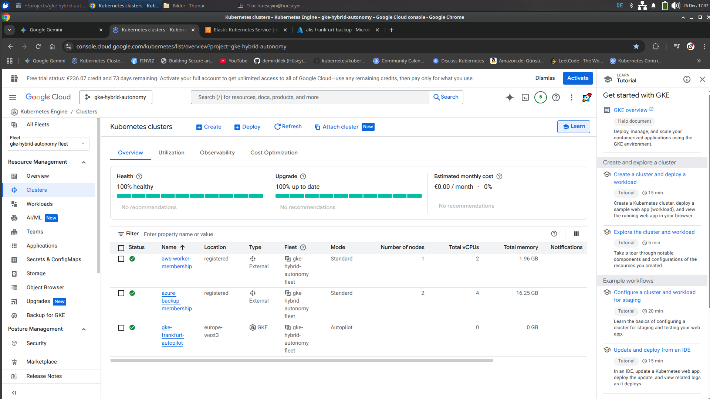

# 🚀 GKE Hybrid Autonomy Framework
**Enterprise Multi-Cloud Orchestration (GCP • AWS • Azure)**

A production-ready hybrid cloud framework utilizing **GKE Enterprise (Fleet)** to manage a geographically distributed cluster mesh. This project demonstrates centralized management, cross-cloud identity federation, and cost-optimized infrastructure as code.


*Status: All clusters synchronized and reporting healthy metrics across three different cloud providers.*

---

## 🏗️ Architecture Overview
Designed with a "Single Pane of Glass" philosophy, allowing all 3 clouds to be managed from the Google Cloud Console.

| Cluster | Cloud | Region | Logic |
| :--- | :--- | :--- | :--- |
| `gke-primary` | **GCP** | europe-west3 | **Control Hub:** GKE Autopilot (Zero-Ops) |
| `eks-worker` | **AWS** | eu-central-1 | **Compute:** EKS v1.30 (Spot-backed) |
| `aks-backup` | **Azure** | germany-wc | **Resilience:** AKS (D-Series v6 Arch) |

### 🌐 Core Infrastructure Highlights
* **Network Topology:** Strict non-overlapping CIDR blocks (`10.128.0.0/20` GCP, `10.2.0.0/16` AWS, `10.3.0.0/16` Azure) to prevent routing conflicts.
* **Identity Mesh:** Implemented **GKE Connect Gateway** to bridge Google IAM identities with AWS IAM and Azure RBAC.
* **SRE Cost Model:** Optimized OpEx via **Spot Instances** on AWS/Azure and **Autopilot** on GCP, achieving an estimated **75% reduction** in idle compute costs.

---

## 🛠️ Key Technical Challenges Solved

### 1. Cross-Cloud Identity Federation (OIDC)
**Challenge:** Managing fragmented credentials across three different cloud IAM providers.
**Solution:** Configured **Workload Identity Federation** and the **GKE Connect Agent**. This allows administrative actions to be performed on AWS/Azure using a single Google Identity, authenticated via OIDC.

### 2. AWS EKS Access Entry Migration
**Challenge:** EKS v1.30+ deprecated legacy `aws-auth` ConfigMaps.
**Solution:** Automated the provisioning of **EKS Access Entries** and Cluster Admin policies via Terraform, ensuring secure, granular access for external principals.

### 3. Azure OIDC Handshake & Tunneling
**Challenge:** SSL validation failures during remote cluster registration.
**Solution:** Deployed the **GKE Connect Agent** using Service Account Key authentication and configured **Gateway RBAC** to allow seamless management from the Google Cloud Console.

---

## 🚀 Operations & Deployment
**Single-command fleet health check:**
```bash
# Check all clusters through the Google Gateway
for ctx in gke-primary aws-worker-membership azure-backup-membership; do 
  kubectl --context=$ctx get nodes
done
```
## 🧹 Clean-up (The SRE Way)
To prevent cost leakage and ensure a clean teardown of cross-cloud resources, follow this decommissioning sequence:

```bash
# 1. De-register memberships from the GKE Fleet
gcloud container fleet memberships delete aws-worker-membership --quiet
gcloud container fleet memberships delete azure-backup-membership --quiet

# 2. Destroy all cloud infrastructure via Terraform
terraform destroy -auto-approve
```
---

## 📈 SRE Insights

* **Observability:** Centralized logging and monitoring through **Google Cloud Observability** (formerly Stackdriver) for all three cloud providers, providing a unified view of telemetry data.
* **Vendor Agnostic:** Standardized on upstream Kubernetes to ensure workload portability and prevent vendor lock-in, allowing seamless migrations between GCP, AWS, and Azure.
* **Infrastructure as Code (IaC):** 100% automated provisioning using **Terraform** with modular providers, ensuring reproducible and version-controlled infrastructure across different cloud environments.
* **Cost Efficiency:** Strategic use of **Spot Instances** on AWS/Azure and **GKE Autopilot scaling** to minimize the financial footprint of a high-availability architecture while maintaining resilience.

---